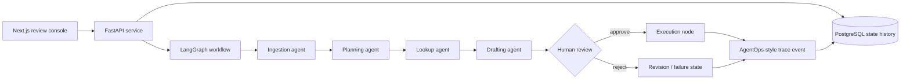

# AgentOps Support Automator


A production-minded multi-agent support automation system that turns messy bug
reports into auditable workflows with classification, evidence lookup, drafted
resolution steps, human approval, execution, and trace history.

## 5-Second Pitch

Most AI demos stop at a chatbot answer. This repo shows the infrastructure
companies actually need: stateful agent orchestration, persisted history,
review guardrails, failure states, and a service UI that makes agent decisions
inspectable.

```text
Inbound Ticket
  -> Ingestion Agent
  -> Planning / Classification Agent
  -> Technical Lookup Agent
  -> Response Drafting Agent
  -> Human Review Guardrail
  -> Execution Node
  -> PostgreSQL State History + AgentOps-style Trace Log
```

## Architecture



## What It Demonstrates

- Multi-agent workflow orchestration with LangGraph
- FastAPI service boundary with typed request and response schemas
- PostgreSQL-backed state history for every workflow run
- Human-in-the-loop review before risky execution
- Failure fallback into `failed_manual_triage`
- Local AgentOps-style telemetry events with trace IDs and node durations
- Dockerized backend, frontend, and database
- Pytest coverage for agent routing and workflow state

## Tech Stack

- Backend: Python, FastAPI, SQLAlchemy, Pydantic
- Agent orchestration: LangGraph
- Observability: local AgentOps-compatible trace boundary
- Database: PostgreSQL
- Frontend: Next.js, TypeScript
- DevOps: Docker Compose
- Testing: Pytest

## Repository Structure

```text
agentops-support-automator/
├── backend/
│   ├── app/
│   │   ├── agents/        # Individual agent logic
│   │   ├── api/           # FastAPI route modules
│   │   ├── core/          # Settings and telemetry
│   │   ├── db/            # SQLAlchemy session
│   │   ├── models/        # PostgreSQL models
│   │   ├── schemas/       # Pydantic schemas
│   │   └── services/      # LangGraph workflow orchestration
│   ├── tests/             # Pytest workflow and agent tests
│   ├── Dockerfile
│   └── requirements.txt
├── frontend/
│   ├── app/               # Next.js review console
│   ├── Dockerfile
│   └── package.json
├── docker-compose.yml
└── README.md
```

## One-Command Setup

```bash
docker compose up --build
```

Services:

- Review console: http://localhost:3004
- API docs: http://localhost:8000/docs
- Health check: http://localhost:8000/health
- PostgreSQL: localhost:5433

Stop the stack:

```bash
docker compose down
```

## Try the Demo

1. Open http://localhost:3004.
2. Click `Run Workflow`.
3. Inspect the generated state trail: ingestion, planning, lookup, drafting,
   review gate, and trace event.
4. Click `Approve` to trigger the execution node and resolve the ticket.
5. Click `Request Revision` on a fresh ticket to park the workflow in
   `needs_revision`.
6. Refresh the browser. Tickets remain because state is persisted in PostgreSQL.

## API Endpoints

```http
GET  /health
POST /tickets
GET  /tickets
GET  /tickets/{ticket_id}
POST /tickets/{ticket_id}/review
```

Example request:

```bash
curl -X POST http://localhost:8000/tickets \
  -H "Content-Type: application/json" \
  -d '{
    "title": "Users cannot log in after token refresh",
    "customer": "Acme Cloud",
    "body": "After the latest deploy, users are redirected back to login. JWT refresh appears to fail for existing sessions."
  }'
```

## Run Tests

Inside the backend container:

```bash
docker compose exec backend pytest
```

Or locally from `backend/` after installing dependencies:

```bash
pip install -r requirements.txt
pytest
```

## Roadmap

- Add real AgentOps SDK export when an API key is configured.
- Add background workers for long-running execution.
- Add GitHub issue and pull request integration.
- Add OpenTelemetry spans for API and database calls.
- Add auth and reviewer permissions.
