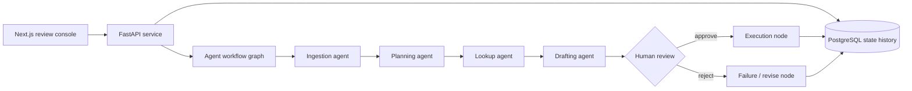

# AgentOps Support Automator

A production-shaped multi-agent task automation system for technical support triage.

The system turns incoming bug reports or support tickets into auditable workflows:
ingestion, planning, evidence lookup, response or patch drafting, human review,
execution, and failure handling.

## Why This Exists

Most chatbot demos stop at a single response. This project shows the harder parts
companies care about when adopting agentic AI:

- stateful workflow orchestration
- human-in-the-loop review
- retry and failure states
- asynchronous task execution
- persisted state history
- service boundaries between API, agents, database, and UI

## Architecture



## Tech Stack

- Python
- FastAPI
- LangGraph-ready workflow boundary
- PostgreSQL
- SQLAlchemy
- Docker Compose
- Next.js

## Local Development

```bash
docker compose up --build
```

Services:

- API: http://localhost:8000
- Frontend: http://localhost:3004
- API docs: http://localhost:8000/docs

## Example Workflow

1. Create a ticket from the frontend or `POST /tickets`.
2. The backend creates a persisted workflow run.
3. Agents classify category, severity, priority, and risk.
4. A response or patch plan is drafted.
5. Risky work pauses at the human review gate.
6. Approval or rejection is stored in workflow history.

## API Sketch

```http
POST /tickets
GET /tickets
GET /tickets/{ticket_id}
POST /tickets/{ticket_id}/review
```

## Roadmap

- Replace deterministic demo agents with LangGraph state graph nodes.
- Add background workers for long-running execution.
- Add GitHub issue and pull request integration.
- Add evaluation traces for agent decisions.
- Add auth and team-level reviewer permissions.
